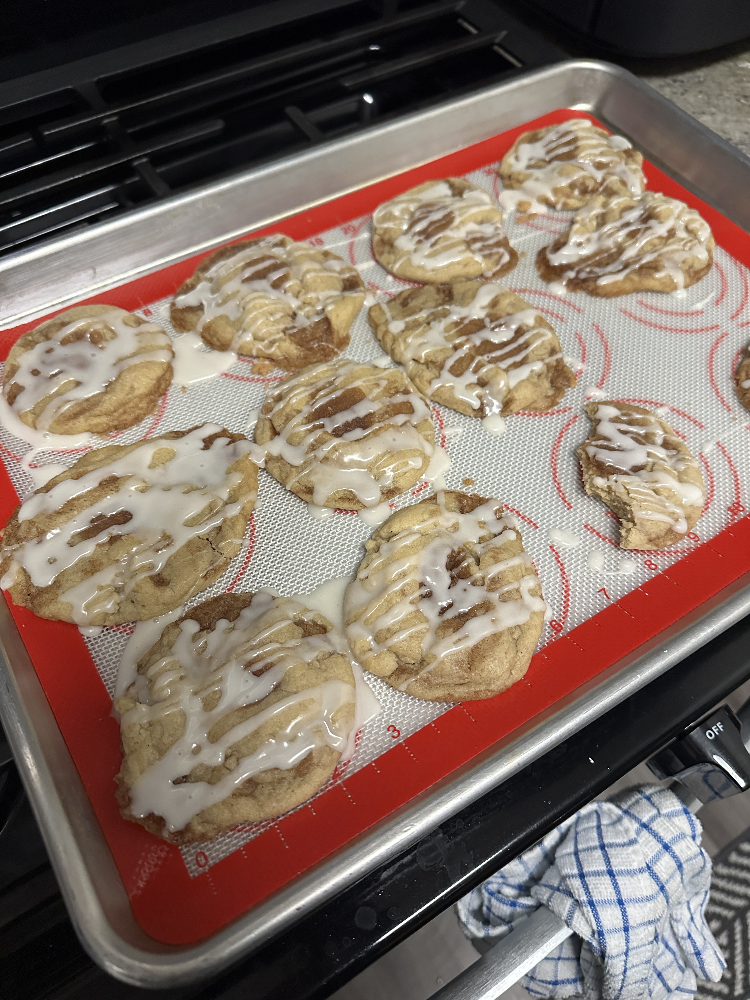

+++
date = '2025-10-22T12:51:52-05:00'
draft = false
title = 'Cinnamon Roll Cookies'
+++

## Food for Thought 🍪
This recipe was just okay. The cookies were very cakey, which neither
I nor Megan really liked all that much. These might be good mixed with
something, like with ice cream or something, but they are not very good
on their own.

We made them before going to a Renaissance Faire, and didn't eat on the
way there, so they were able to keep us from going hungry.

## Making the Recipe

Making the recipe was really easy, you just have to make sure to let them
cool down first before drizzling the glaze on top.

## Final Result

## Recipe
