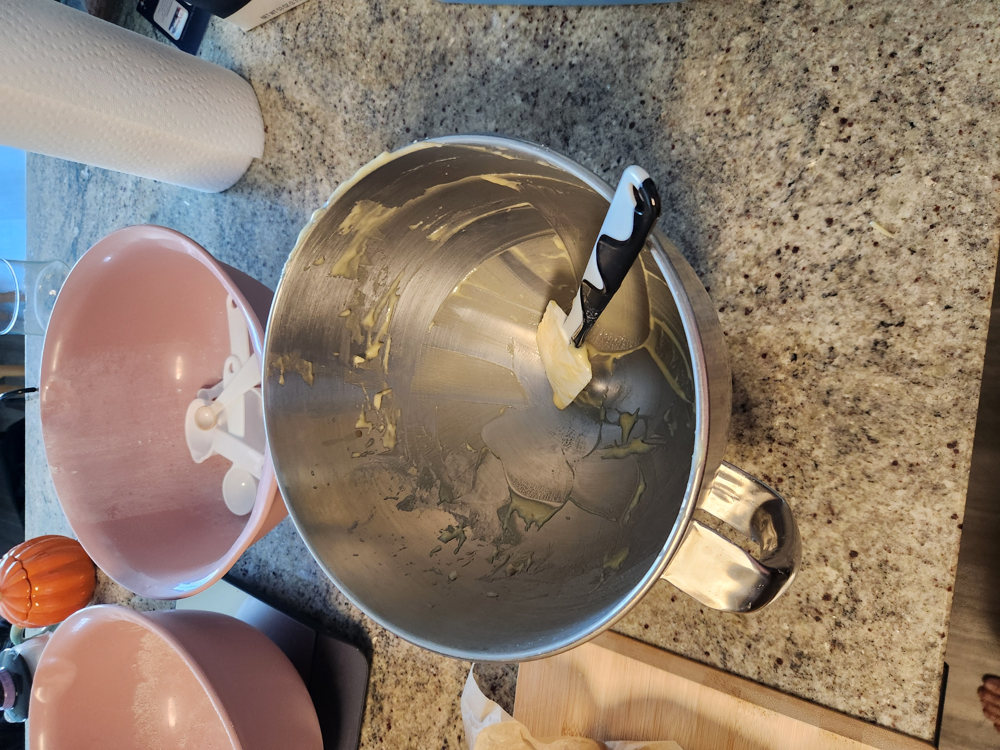
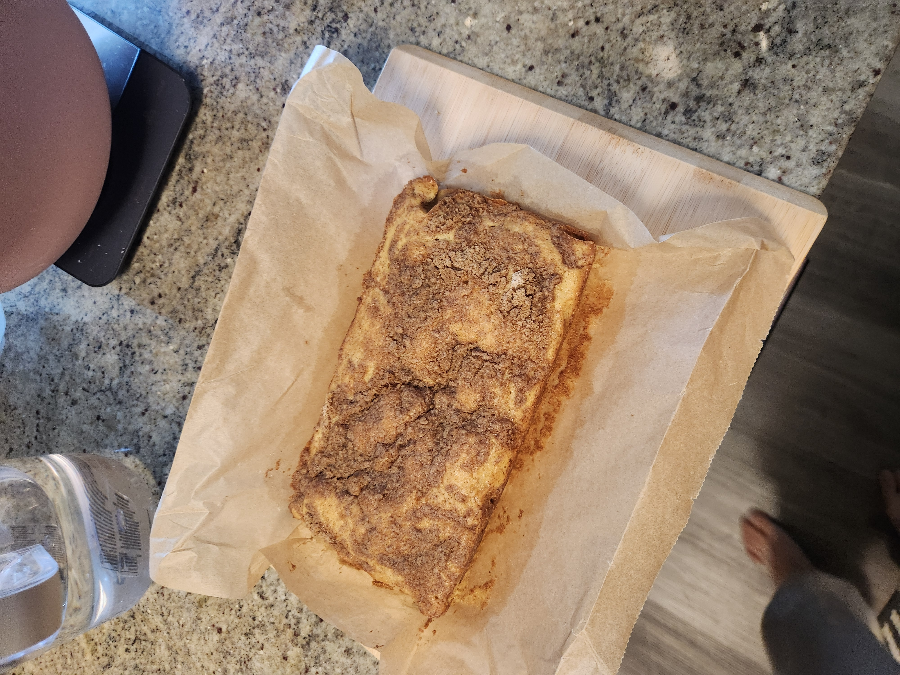
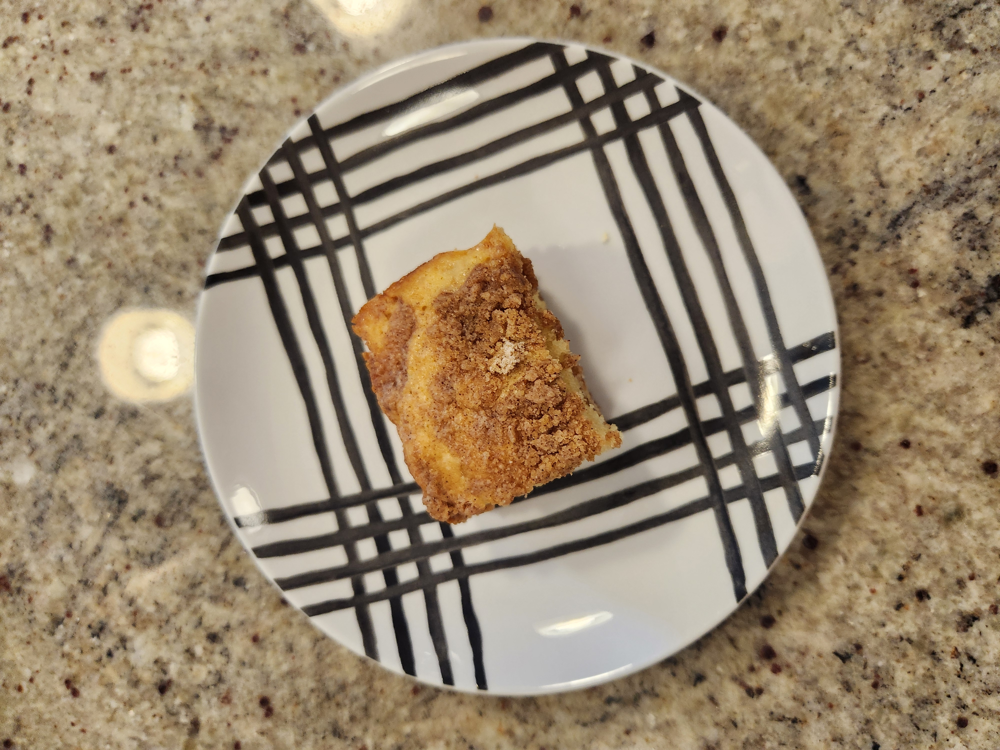
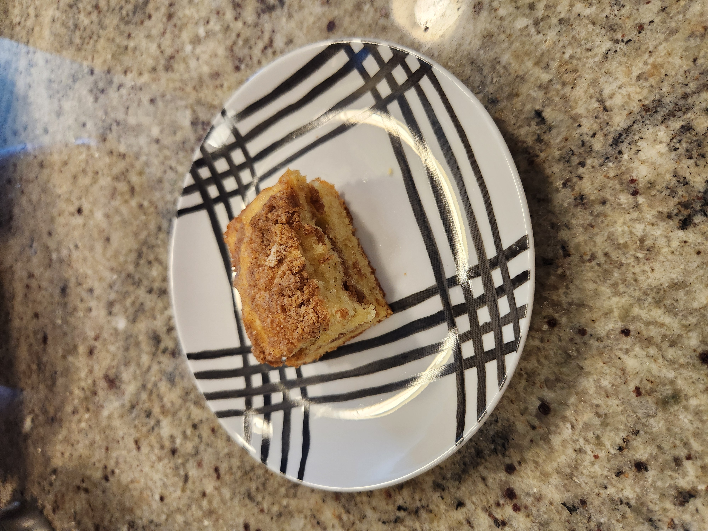

+++
date = '2026-01-28T21:31:48-05:00'
draft = false
title = 'Coffee Cake'
+++

## Food for Thought 🍪

This cake was very delicious. Not too sweet, and very light and fluffy when
it's warm. It's a pretty classic coffee cake but done well. The recipe was also
very easy to follow. We halved the recipe and it still turned out well in a
smaller baking tin.
The recipe also uses sour cream, which makes it nice and moist.

## Making the Recipe

Mix the ingredients and pop it in the oven.

Below is the cake just out of the oven.

## Final Result

## Recipe
