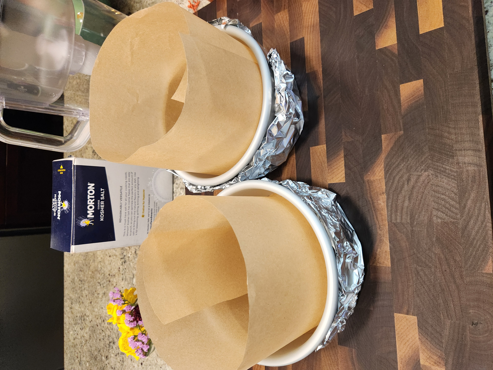
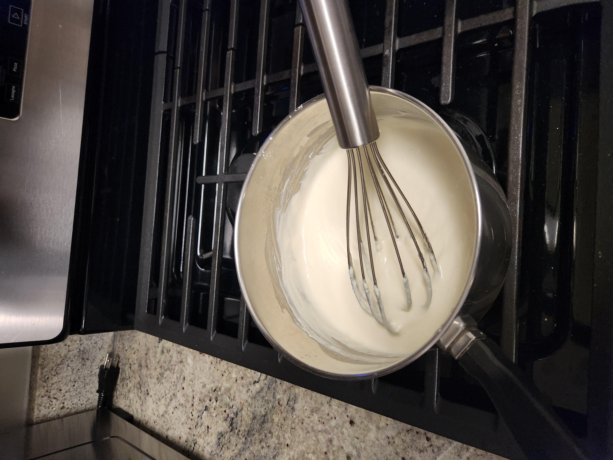
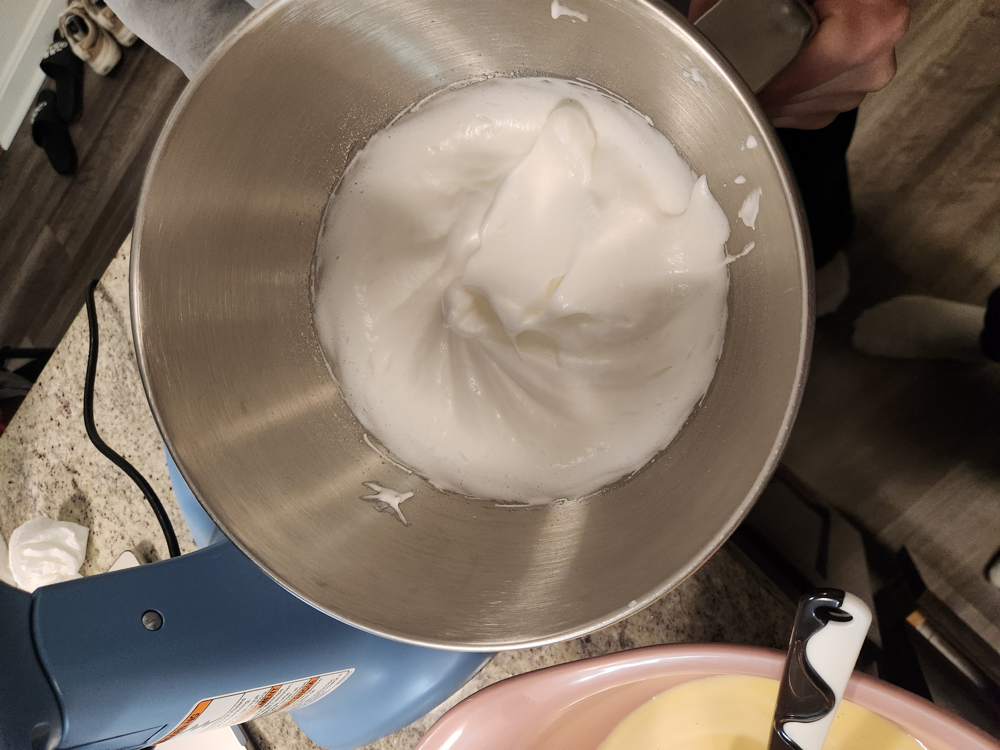
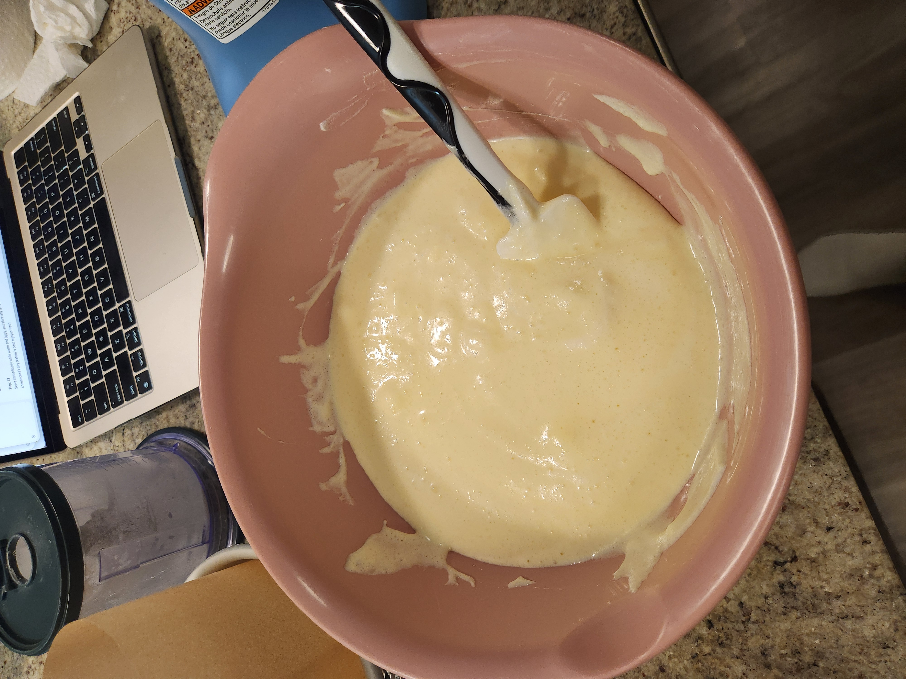
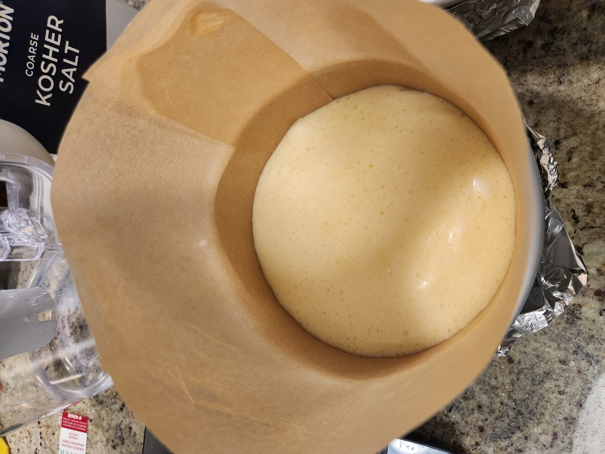
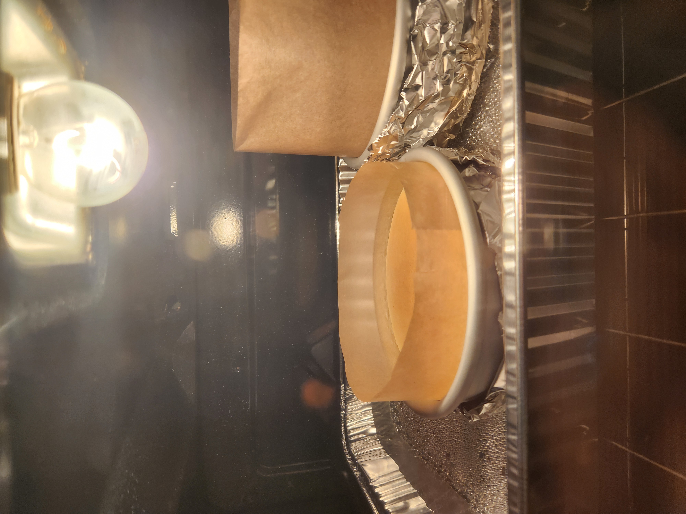
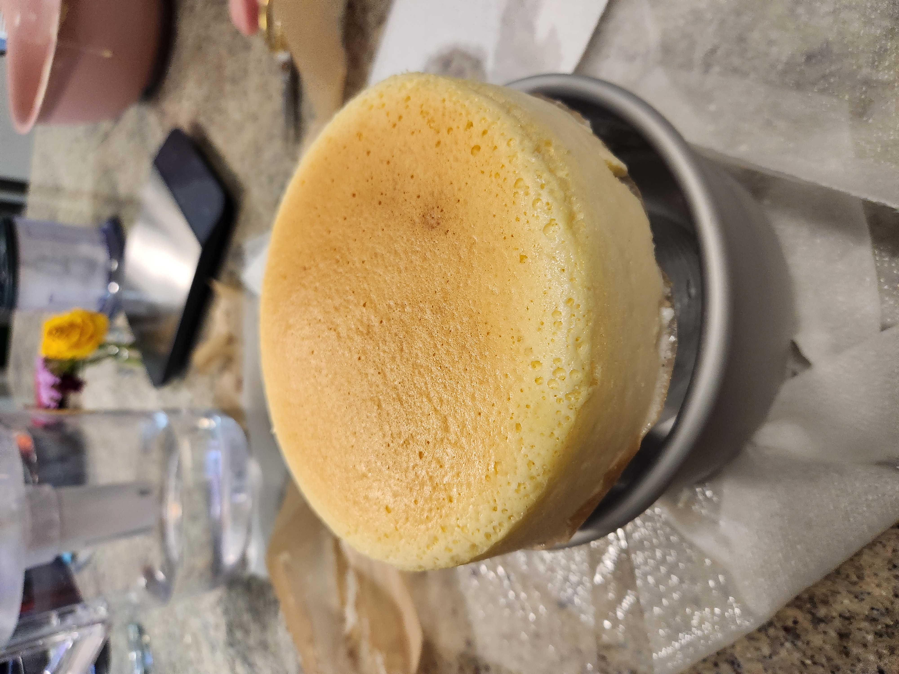
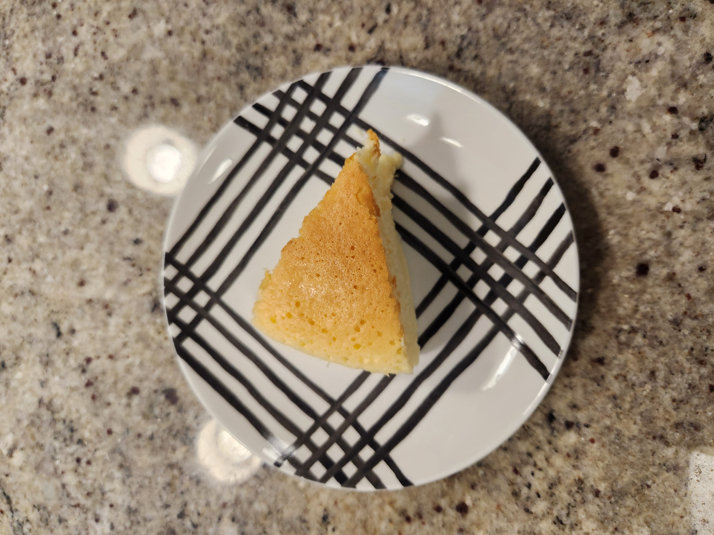
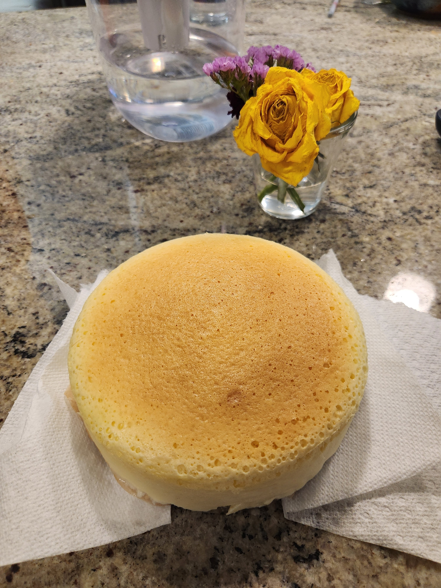

+++
date = '2026-02-21T01:38:27-05:00'
draft = false
title = 'Japanese (Jiggly) Cheesecake'
+++

## Food for Thought 🍪
This recipe was really good! Definitely recommended.
The cake was very light and airy, with a pretty mild flavor, which is good.
We made a couple mistakes when doing the recipe though, but it still tasted good
even with those, which means that the recipe is good haha.

When making tin foil boats for our cake tins, we did not make one of them well enough, and
water got in, since we were floating them in a water bath to cook. This made the bottom of
that cake not cook properly, and caused it to be soggy on the bottom still.

We also had the parchment too tall on the cake tin for one of the cakes, which meant it could
not cook as well as it should have, and it had to be left in the oven for longer.

The good part, though, is that these cakes don't really seem to overcook / dry out even
if you leave it in the oven for a while, likely b/c of the water bath. So, if the cake is
not cooked yet you can always leave it in longer with no fear of it drying out.

If the cake is not browning at the end step, you can also crank up the temperature.
My oven was not hot enough at the recommended 300 fahrenheit, and I had to increase
the temperature for the cakes to brown properly.

## Making the Recipe

It was pretty easy to make this recipe, and it was pretty fun too.
The recipe only used a few ingredients, most of which I already had on hand.
The only things I really had to go out to pick up was whole milk, and cream cheese.

Line the cake tins with parchment paper.

Add the cream cheese, butter, and milk in a saucepan on low heat, and incorporate, then remove
from heat.

Sift in the cornstarch, salt and flour and mix until smooth.

Slowly add in the egg yolks, thoroughly mixing after each yolk.
![mixed after egg yolk]

Whip the egg whites, and gradually add the sugar, until you have soft peaks.

Fold the whipped meringue into the cream cheese batter, making sure it stays fluffy

Pour the batter into the cake tin(s) and bake

Once it's finished baking, it should be lightly browned on the top

## Final Result

## Recipe

https://mealie-pub.bhnord.com/g/home/r/jiggly-japanese-cheesecake
