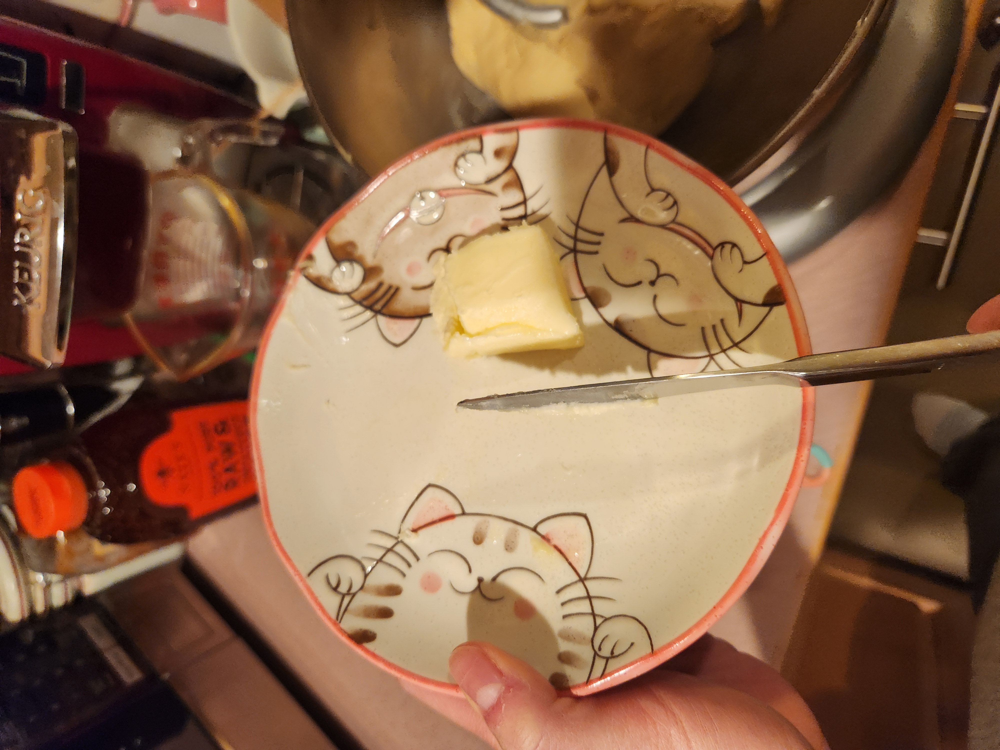
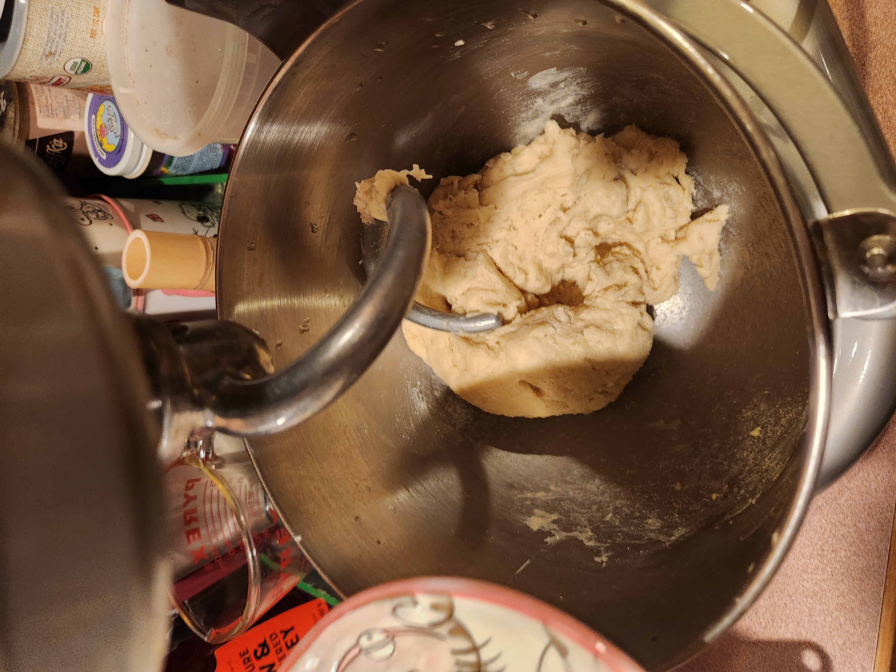
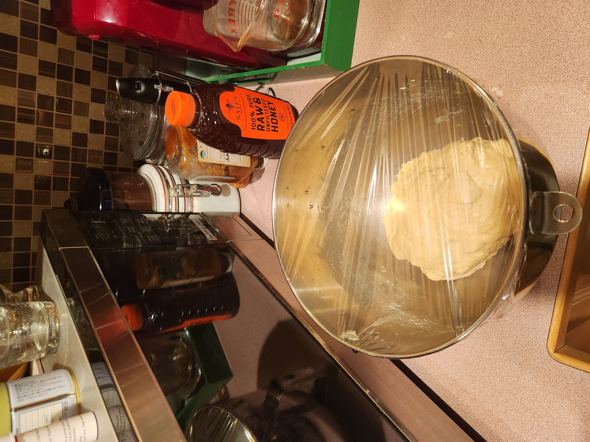
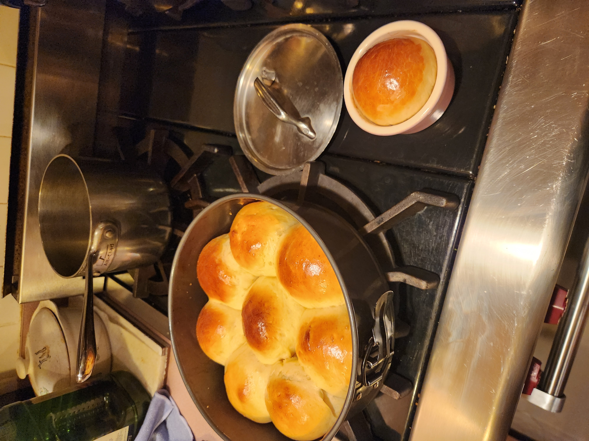
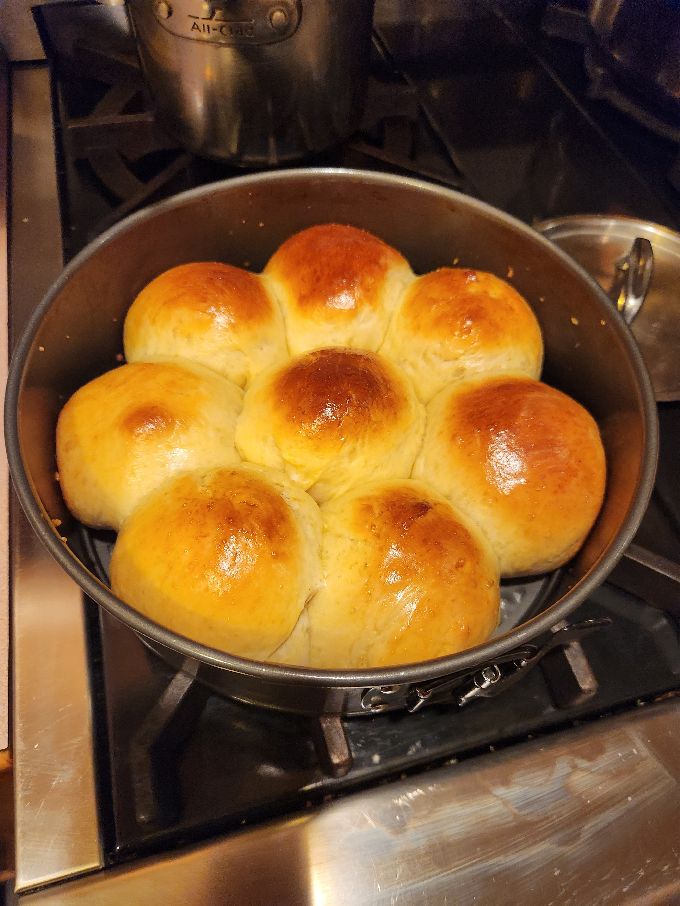

+++
date = '2026-02-06T12:40:37-05:00'
draft = false
title = 'Japanese Milk Bread'
+++

## Food for Thought 🍪

Milk bread was (apparently) pretty good.
We baked some of the bread in ramekins since we ran out of room in the pan, and they did not fluff up 
properly + were pretty dense.
I didn't end up trying one of the rolls that were baked properly in the pan, but Megan told me they were good.
When baking them, make sure to give them enough room to rise properly in the oven lol.

## Making the Recipe

It was pretty simple to make, basically just mix everything together, proof the dough, shape it into balls,
proof it once more and bake.

## Final Result

## Recipe
