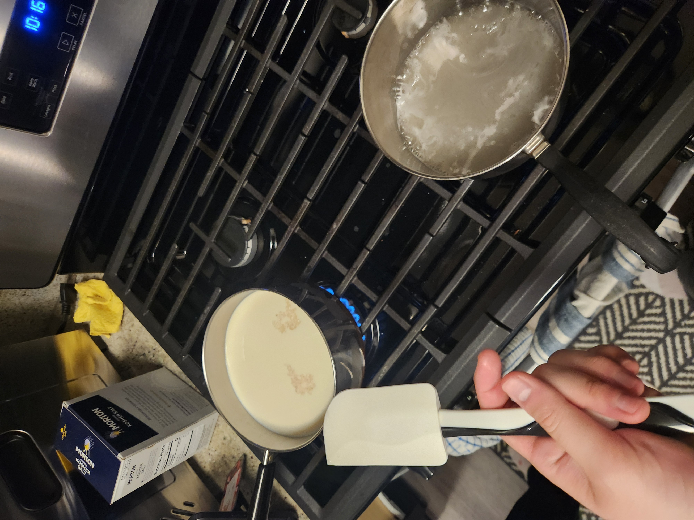
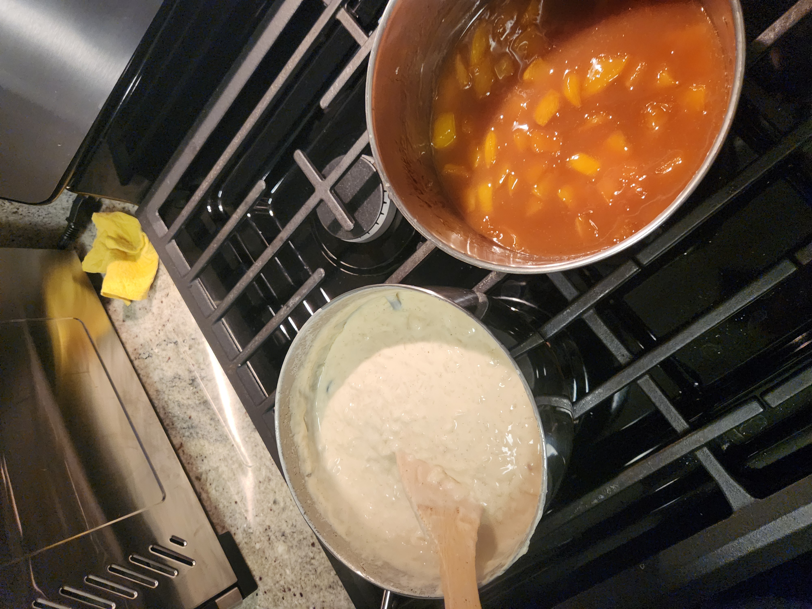
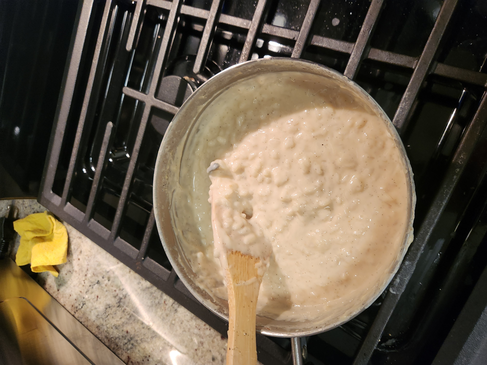
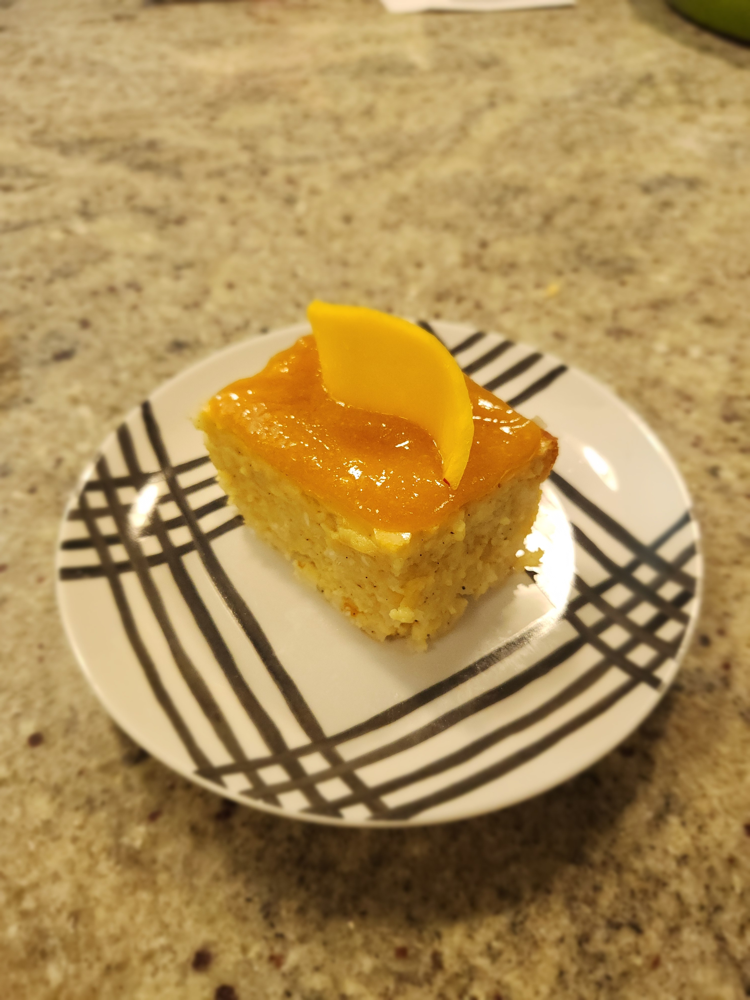

+++
date = '2026-01-11T01:38:27-05:00'
draft = false
title = 'Rice Pudding Cake'
featured = './final-result.jpg'
+++

## Food for Thought 🍪
This cake was pretty good, but contains a lot of lactose.
Megan is lactose intolerant so she needed to eat a Lactaid.

The mango caramel was fun to make and tasted pretty delicious.

Although the cake was not bad, I honestly think I prefer the rice pudding before we baked it more, because it had better texture and flavor, so this can definitely double as just a good rice pudding recipe if you leave out the baking step and the eggs.

## Making the Recipe

For the caramel we used low heat instead of medium heat so we could keep
an eye on it and prevent it from burning. I also have a gas stove, so the
stovetop can run a bit hot.

We were able to get a nice golden brown caramel, and added the mango pieces and butter once the sugar was browned. 

The rice pudding thickened up nicely too, but required constant stirring.
It also took a while for the rice to cook, but we were able to tell by the
rice being suspended in the liquid and a few tastings.

The rice pudding looks delicious and tasted delicious too.

## Final Result

## Recipe
