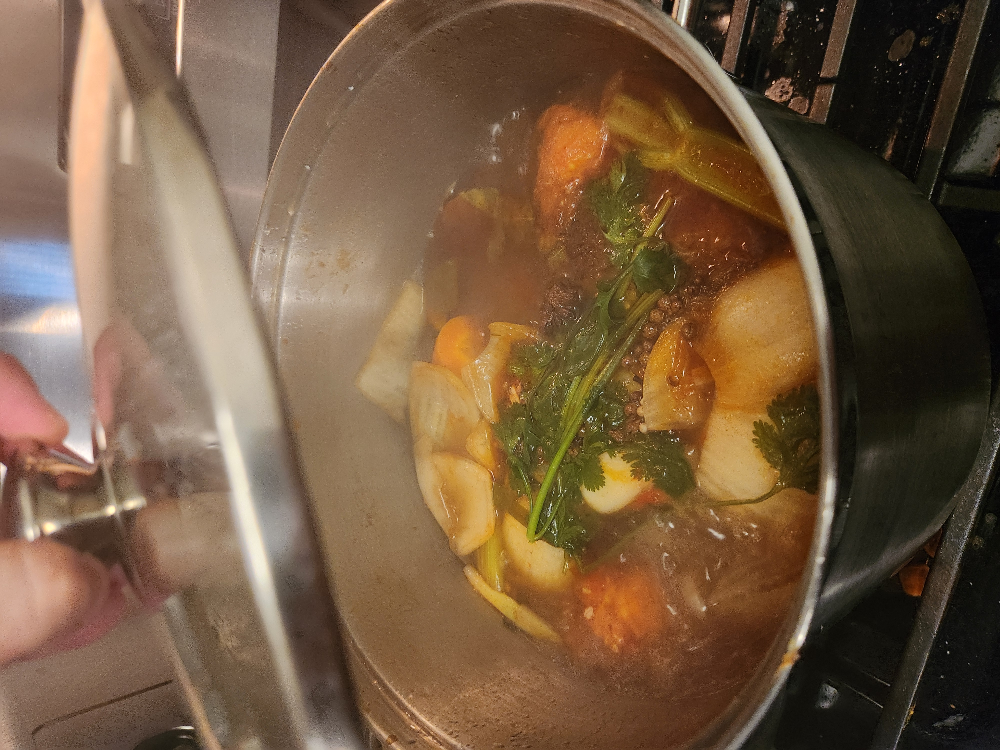
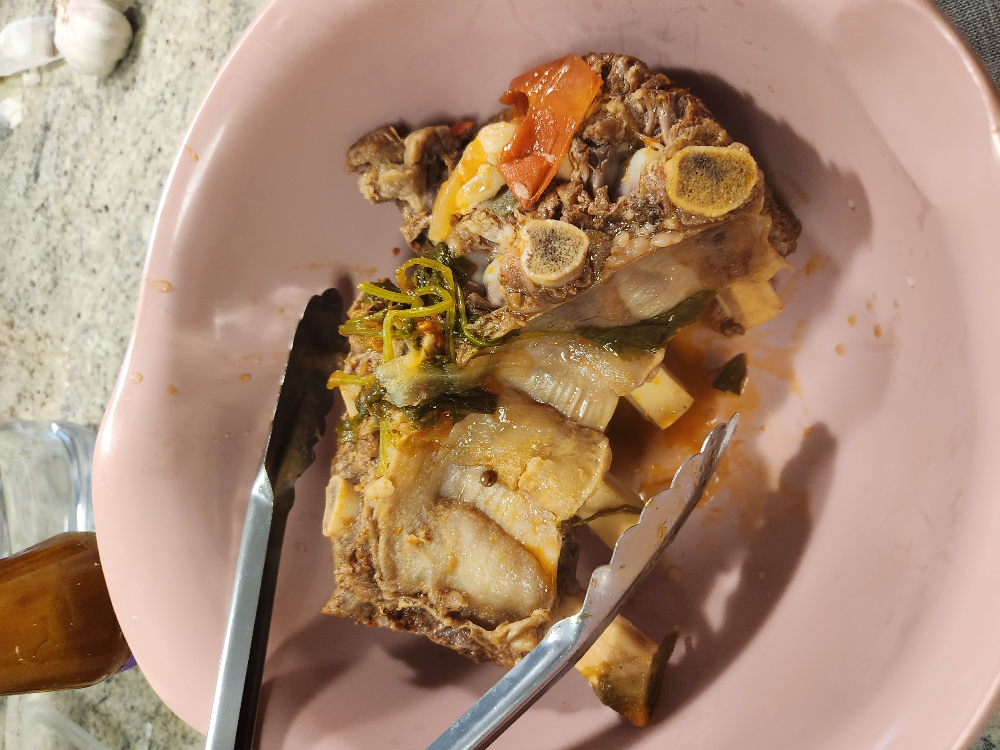
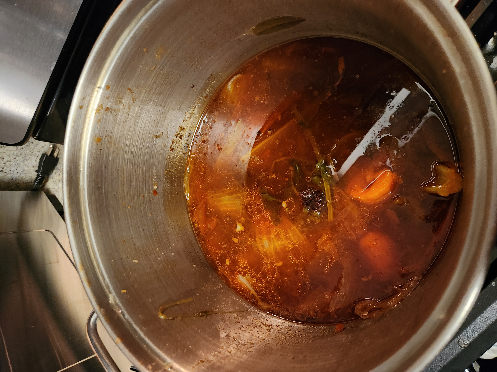
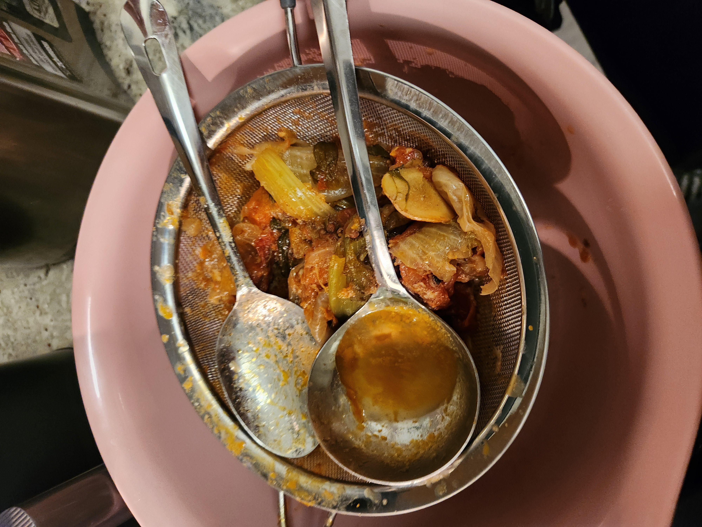
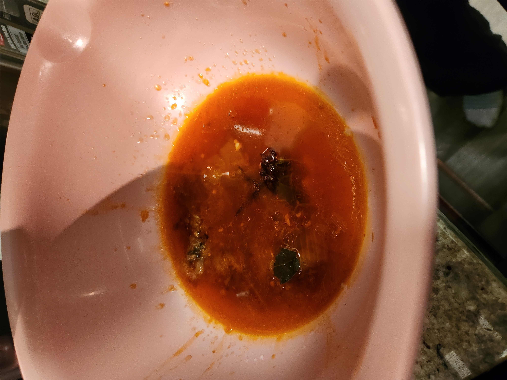
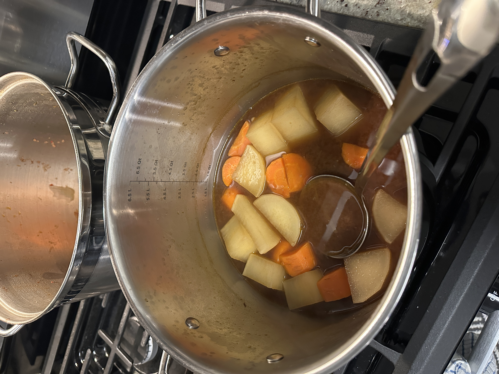
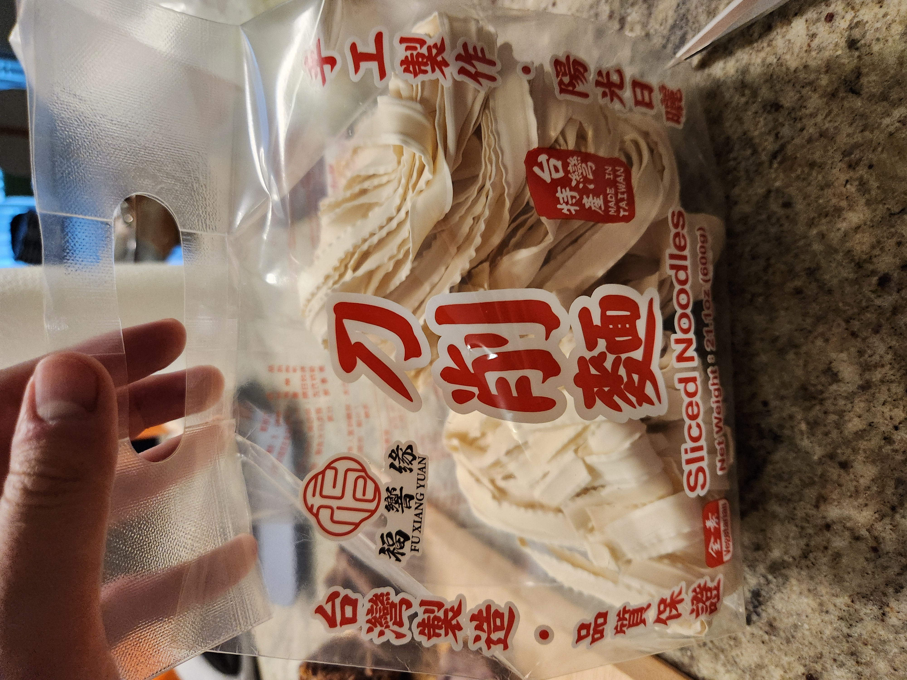
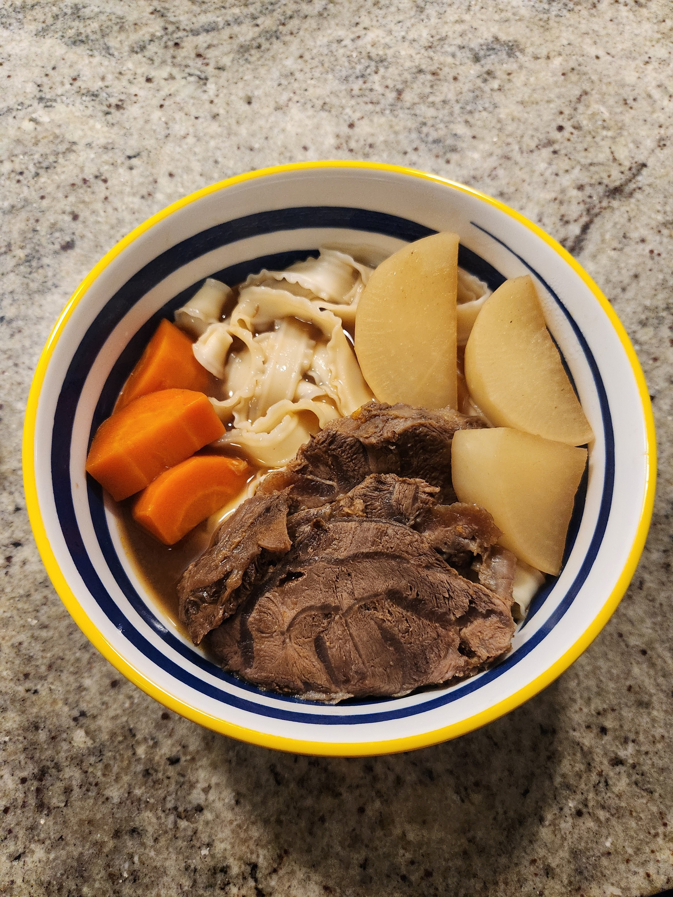
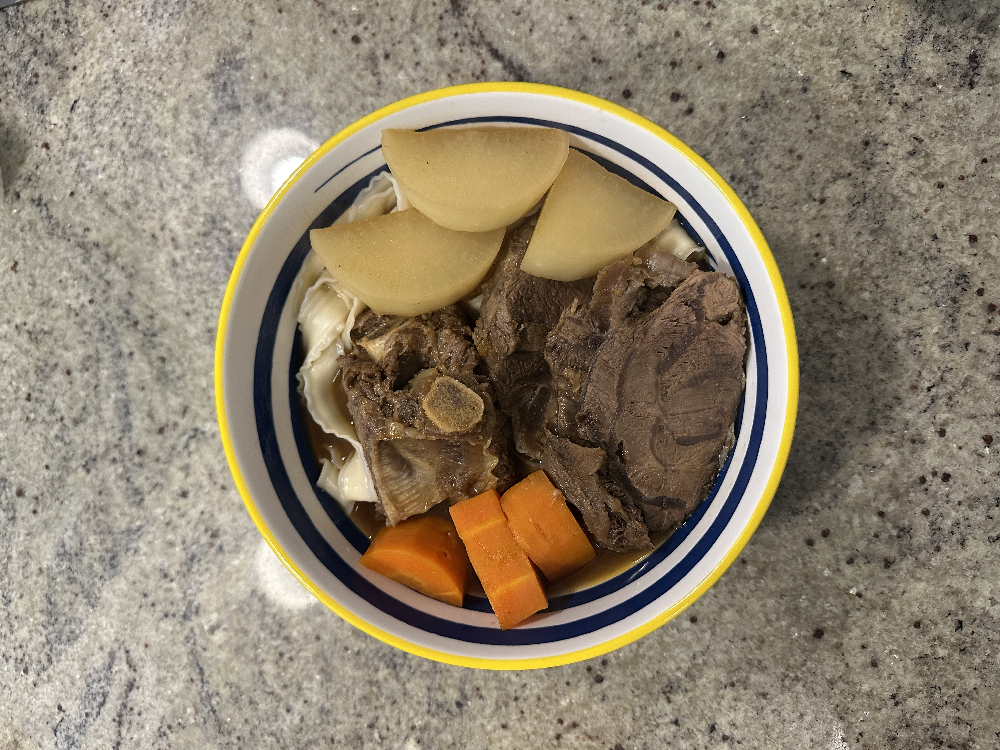

+++
date = '2026-01-19T00:33:51-05:00'
draft = false
title = 'Beef Noodle Soup'
+++

## Food for Thought 🍪

We thought this recipe was very good, but a lot of work. It also didn't make that many servings
in the end at all, maybe around 5 servings, but it took many hours to cook.

There was good flavor in the soup as well, but I think we needed to cook the beef shank longer as
it was a little bit tough when we were eating it. The beef rib came out well, however.

## Making the Recipe

First you have to chop up a lot of veggies to make the stock, and
blanch the meat in cold water up until it boils. After the meat
is done blanching, rinse it with cold water to remove any leftover
scum.

Then, sautee the vegetables and add the sauces in, making sure to
get the vegetables a little soft.

Next, you have to add in the meat and try to mix it all up
(this is kind of hard with the big meat chunks) so that the
sauce sticks to everything. De-glaze the sauce with the cooking
wine, and cook it down a bit.

Chuck in the water, add the spices, and bring it to a boil 
for a while.

Turn off the heat, and keep the pot covered for 30 more minutes
after the boiling is done.

Take out all the meat and set it aside.

Now, you can strain out all the leftover veggie and residue left
in the pot (make sure to keep the soup lol).
There will be a lot of residue and muck leftover.

Once that is done, you have to scoop out all of the oil on the top,
which there will also be a whole lot of.

You can either let the soup sit overnight and scoop out the hardened
oil, or bring the stock to a gentle boil and scoop out the oil
that way.

Now that the soup is oil free (or mostly oil free), you can add in
the rest of the veggies and bring the soup back up to a boil.
Also bring a pot of water to a boil to boil the noodles shortly.

The meat should be about room temperature by now, so it
will be ok to cut it. Cut it into around 3/4 in thick pieces
to add back into the soup in a little bit.

Once the stock is done boiling the veggies, put the meat back
into the stock to re-heat.

Cook the noodles at the same time according to the directions on the
package. We used some thicker knife cut noodles we found that were
pretty good.

Once the noodles are done, and the beef is finished reheating,
assemble and enjoy.

## Final Result

## Recipe

*source: https://www.youtube.com/watch?v=F1FQutMsSEc*

### Ingredients:
- 4 pieces Lee Kum Kee Knife-Cut Noodles
- 3-4 pieces Beef Short Ribs
- 500g Beef Shin
- 2 pieces carrots
- 2-3 stalks Green Onions
- 5-6 cloves Garlic
- 5 slices Ginger
- ½ piece Daikon Radish
- 2 big Onion
- 3 Tomatoes
- 2-3 stalks Celery
- 2 stalks Coriander
- As needed Water (around 1800-2000ml)

### Seasoning:

- 2 tablespoons Lee Kum Kee Sauce for Peking Duck Sauce
- 2 tablespoons Lee Kum Kee Chilli Bean Sauce
- 100ml Rice Wine
- 125ml Lee Kum Kee Premium Light Soy Sauce
- 20g Rock Sugar

### Spices:

- ¼ teaspoon Five-Spice Powder
- 1 teaspoon Sichuan Peppercorn
- ½ tablespoon Black Peppercorn
- 1 piece Star Anise
- 3 pieces Bay Leaves

### Notes:

- Blanch the meat
- Use cold water to slowly release the blood from meat
- Use wok/saute in pot veg, seasoning, spices, water
- (transfer if in wok) Bring to boil in pot, simmer for 1-1hr15min, take beef shin out at 45 min mark, check on it
- Turn off heat and keep pot covered, sit for 30 min
- Take out beef ribs
- Strain out all the veg and residue
- Let remaining soup cool overnight, beef fat float to surface, skim fat
- (ricky insights: when rolling boil the fat goes to the side, scoop from side)
- Reheat soup, add in the remaining carrots and turnips (cook for 20 min) then add in sliced meat to reheat
