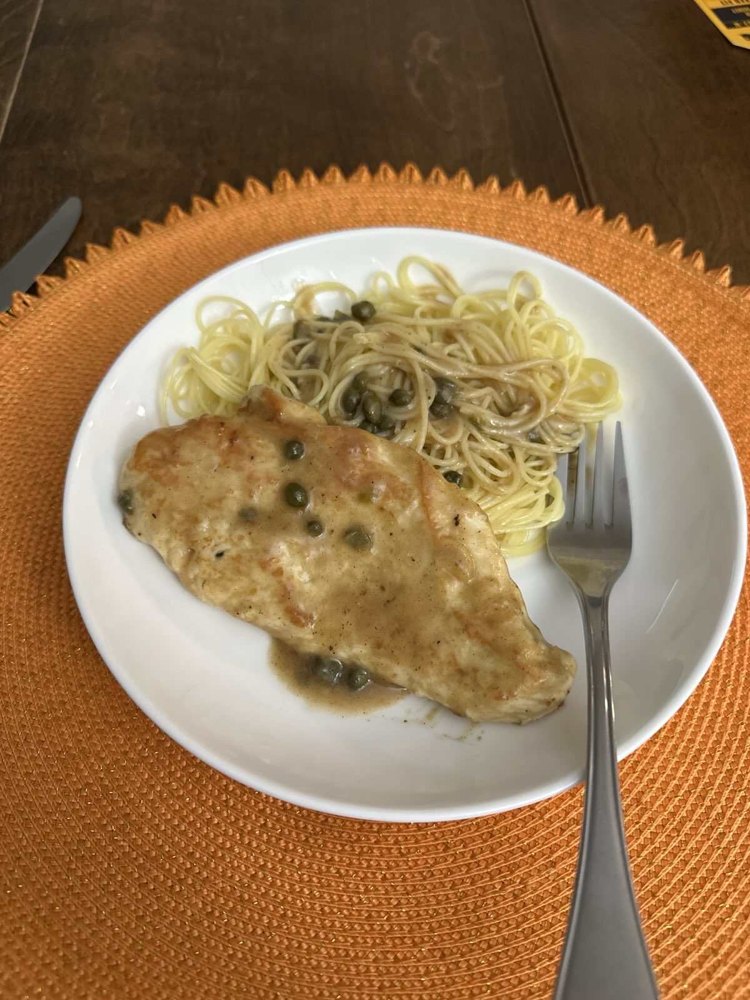

+++
date = '2026-01-11T01:38:55-05:00'
draft = false
title = 'Chicken Piccata'
+++

## Food for Thought 🍪
This recipe was very good. We messed it up a little bit by putting the heat up too high, but it still tasted pretty good.
## Making the Recipe
Again, since my gas stove runs a little bit hot, we should have had the heat down lower than we did.

When adding the butter to make the sauce, also make sure to let the pan cool down first. We didn't do this, and the butter browned / burnt way too quickly, which messed up the color of the sauce a little bit.

When making the mixture for the chicken breading, make sure to salt very generously, as this gives the breading the flavor
## Final Result

## Recipe
