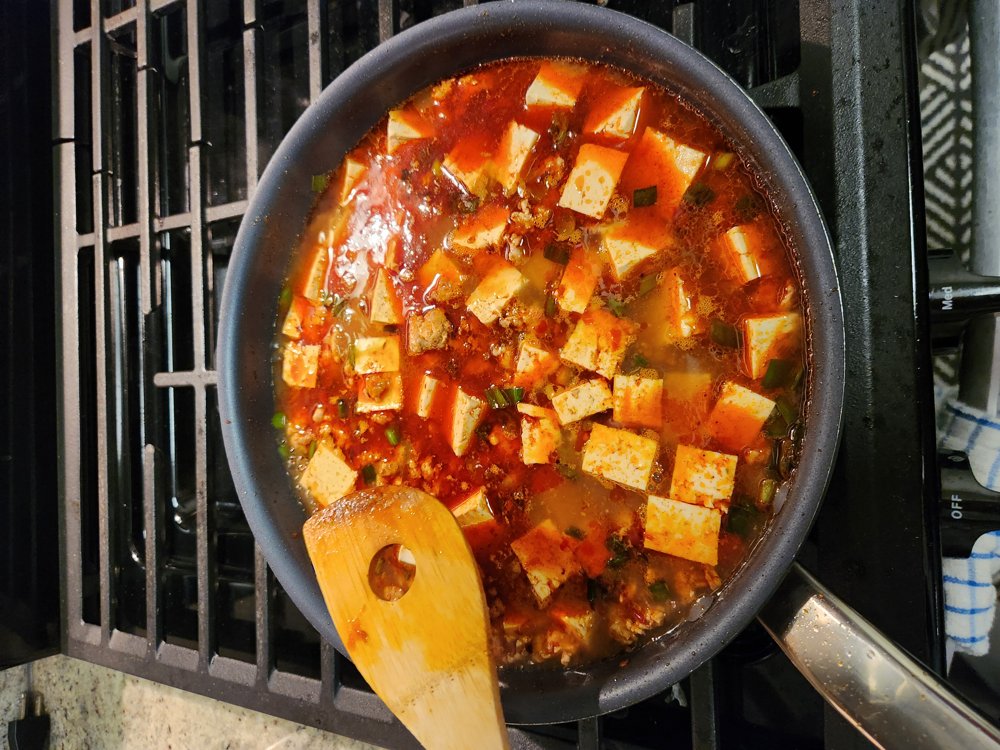
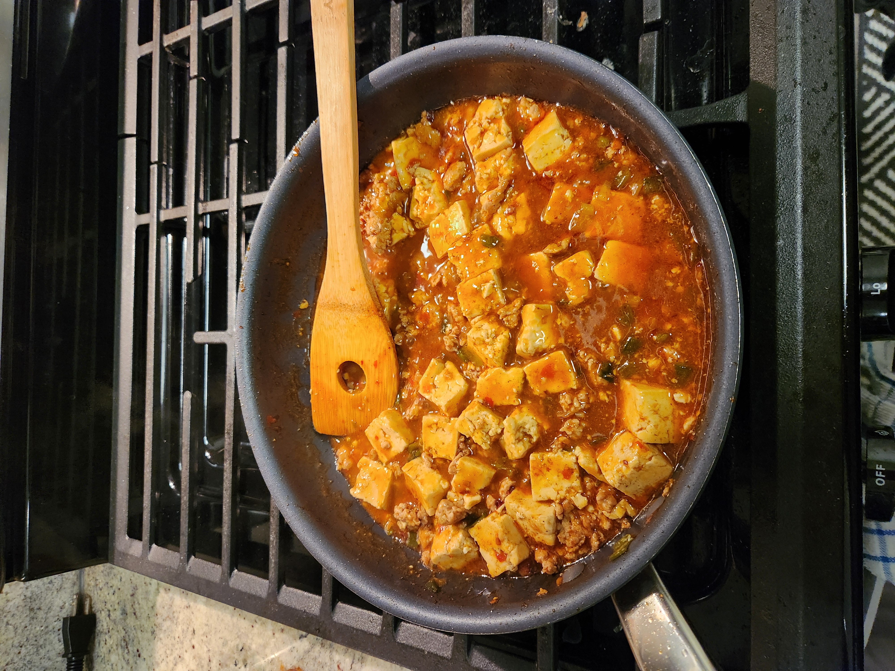
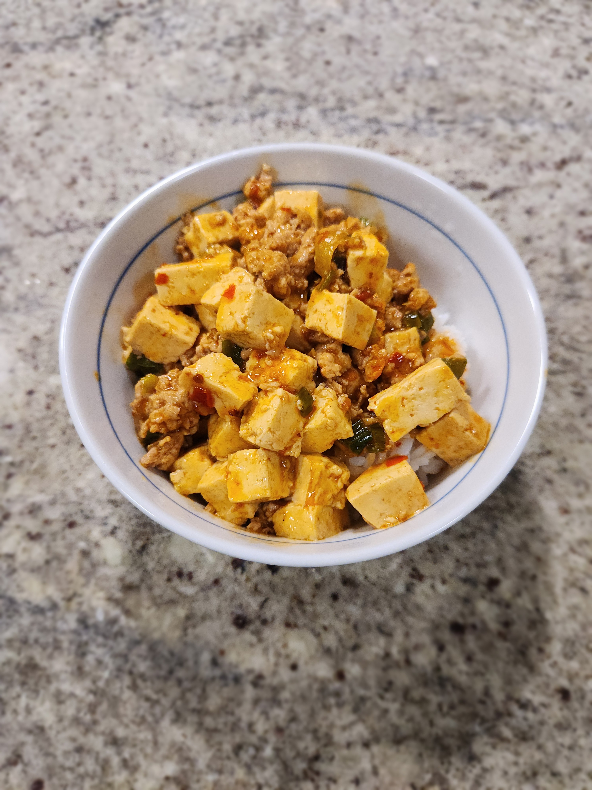

+++
date = '2026-01-30T12:37:41-05:00'
draft = false
title = 'Mapo Tofu'
+++

## Food for Thought 🍪
This was a pretty yummy recipe. We tried to double the recipe because we had double the pork.
Was a little too spicy... (note: don't double the Sichuan peppercorns...). 
We also used way too much chicken stock and had to reduce it down for a long time (oops)! 

## Making the Recipe
There weren't too many "specialty" ingredients we had to look for,
to make this recipe, mostly just Doubanjiang sauce, and Sichuan peppercorns

First mix the ground meat up with the cooking wine, soy and ginger.  

Toast the peppercorns in a skillet until cripsy, and keep the oil  

Add the ground meat and doubanjiang sauce. Cook and chop up the meat into 
little pieces. Add green onion and stir fry more.

Add the tofu and the rest of the spices, pour in the broth and simmer down
until it reduces.

Mix the cornstarch in as a slurry to thicken the mixture.

Serve with rice :D

## Final Result

## Recipe
